# eHMI_Water_Plant_Demo
 ## High Graphic Water Plant Animation
 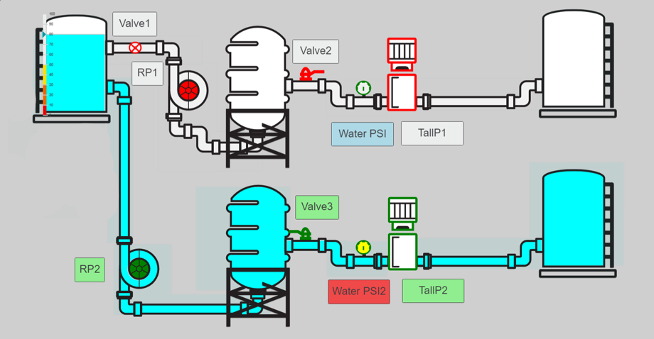

 ### Summary: 

 This is a step by step guide on how the above water plant animation was created using Inkscape, PLCnext Engineer, and the PLCnext starterkit. 

### Step 1 (Combine SVGs)

- You will need Inkscape installed
- Open all of your SVG images in inkscape and copy them all onto one page. Right click -> Open with -> inkscape vector graphics editor
- You can also try to drag and drop from your folder to the page (this isn’t 100% reliable because the objects fill and stroke are not defined so as you drag more objects in your SVGs can change in appearance. In order to prevent this you need to define the fill and stroke on the SVG objects you want to use.)
- If possible you could also request that your graphic designer designs all your SVGs on one page so you can skip this step. Then just delete anything you don’t want to use. 

### Step 1.2 (Recommended Method)

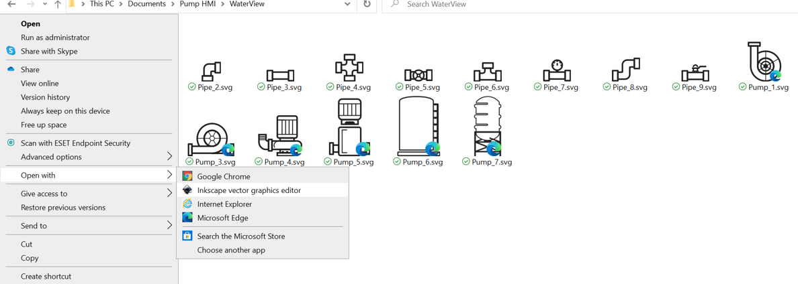

### Step 1.3
- Using Drag and Drop

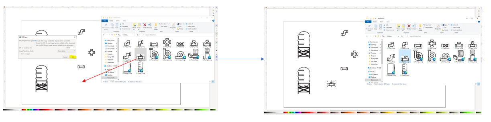
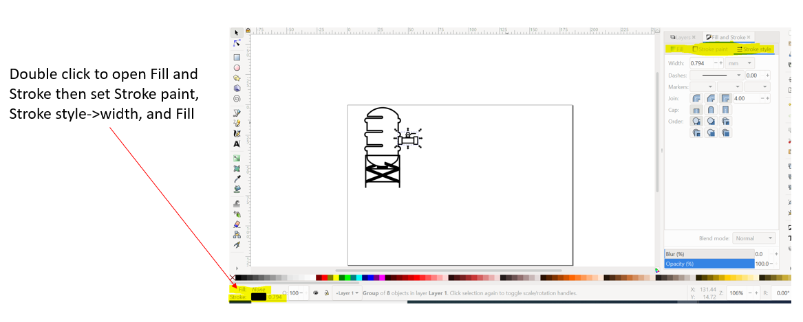

### Step 2 (Arrange)

- Arrange the SVGs as you want them on the screen then duplicate the SVG file.
- This is so we can eventually have two separate layers. One with the details of the SVGs and the other a cutout for background animations.
- To change page size ctrl+shift+D opens Document Properties which you can then put in the custom size page you want 

### Step 3

- Once you have two files select one to be your detail layer. 
- Make sure there is no color to your page. (it should be transparent when we import it to PLCnext)
- Then proceed to delete every Drawn element that you want animated

**Example:**

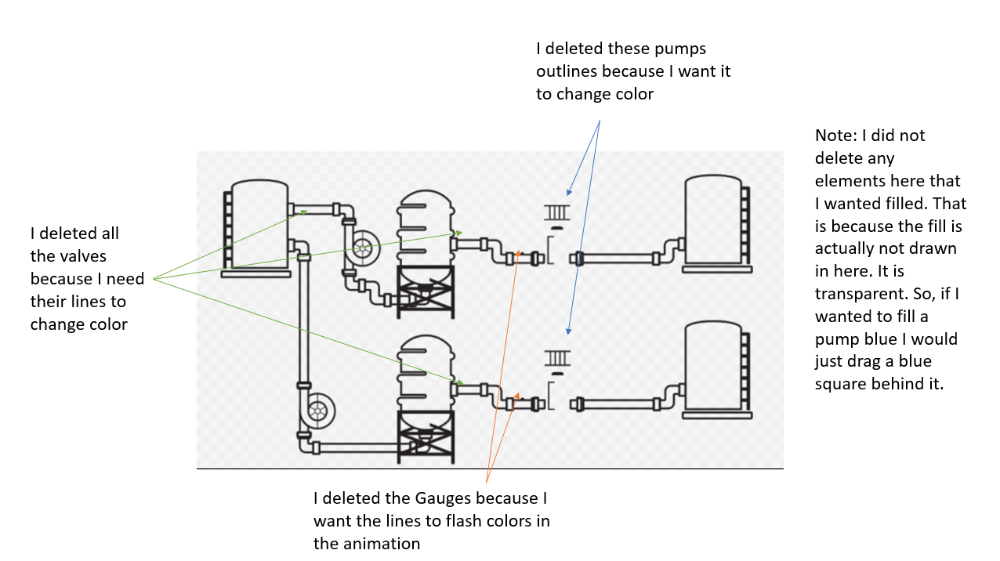

### Step 4 (Clip Path/Cutout Layer)

For this example, I needed a section of pipes to become blue for the animation of water. However, since I did not draw all the pipes in PLCnext Engineer I cannot just use a fill function on every pipe. Instead, I created a large shape that could change color from white to blue when a button is pressed. Then I sent it to the back of the detailed layer. However, the result is the following which is why I needed a cutout layer:
 

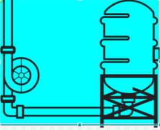

- The detailed layer lies on top of the cutout layer which hides the excess blue shown on the previous slide. 

**Layers:**

- Create a rectangular background the color you want. 
- Create two layers one for the rectangle you just made and the other for your SVG system

- To move a object or group of objects to a layer select them all and then right click to select move to Layer. Then select the layer you want them on. 

- Select the background and an element from the screen by holding the shift bar and clicking them both.

- Then go to Path->difference. This should cut out a hole in the image as shown on the right. 

- Repeat this for every element that needs to be cut out and delete the detailed lines of the pipes

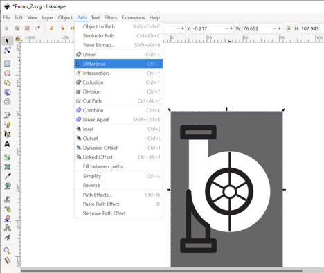

**Result:**

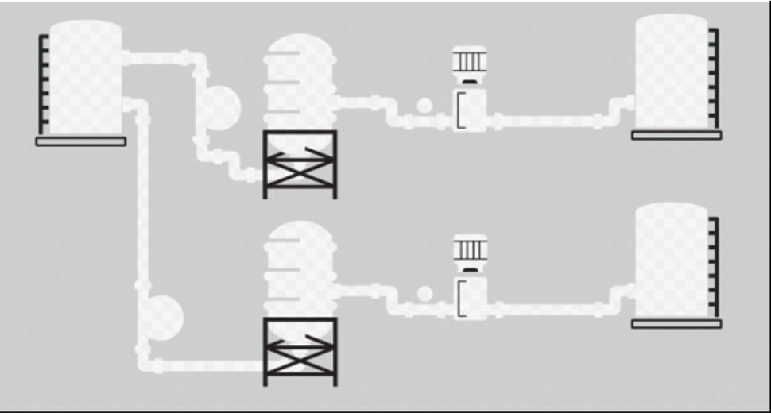

### Step 5 (Import SVGs as Images)

- Open a new PLCnext Engineer project and create a HMI page. 
- Under Components on the right side of the screen select HMI dropdown then right click the images folder and Add HMI Images. 
- Find the detailed layer and cutout layer SVGs and import them both
- Then drag and drop the images onto the HMI screen and layer them so the cutout layer is under the detail layer 
- **Note:** If some of the elements seem to be compiling in a corner of the screen rather than the positions you placed them try to ungroup the elements and reimport the image. 

### Step 6 (Create Animated Elements)

- In Step 3 we needed to delete every element drawn on the screen. Now we must create those elements in PLCnext Engineer. 
- These elements will be placed above the detailed layer along with the buttons.

### Step 7 (Background Elements)

- In this step we create everything we want sent to the background of the screen. For this example, this will consist of rectangles and circles for the animation of water. 

**Everything made in PLCnex Engineer:**

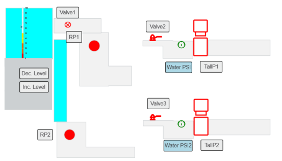

### Step 8 (Add Code)

- Under Components on the right side of the screen go to Programming->Local->Programs->Main
- You can then create Variables under the designated tab and create your code under the Code tab

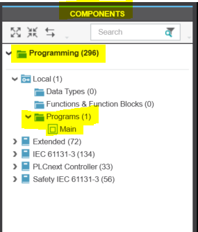

**Code Tab:**

- You can drag and drop or search for your logic by double clicking on the main screen

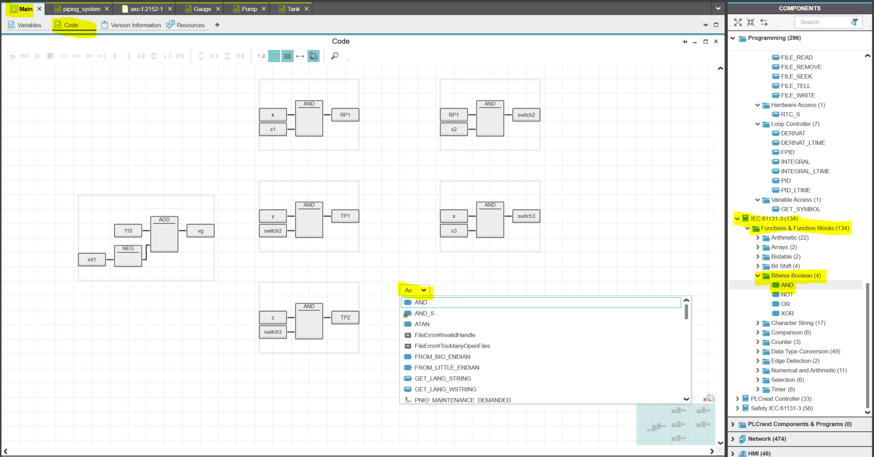

**Variables tab:**
- You can create Variables and make them External for use here

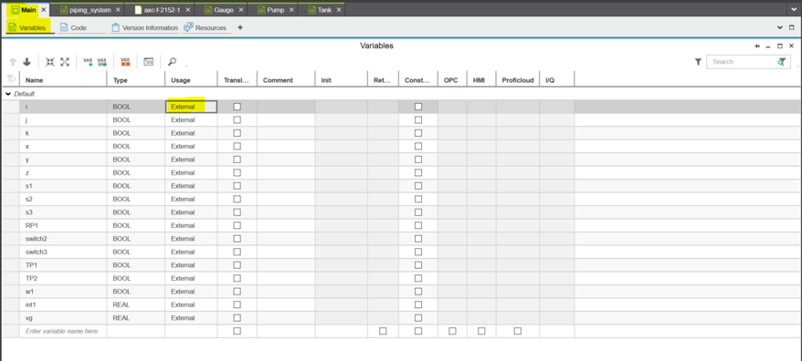

### Step 9 (How to use Variables in HMI Page)

- To use your variables in the HMI page you need to make them HMI tags. To do this go Under Plant on the left side of your screen Project->(Your system name) and double click your system name to open
- Then under the Data List tab you will find your variables. When you right click the variable  you can Add HMI Tag. 

**Example:**

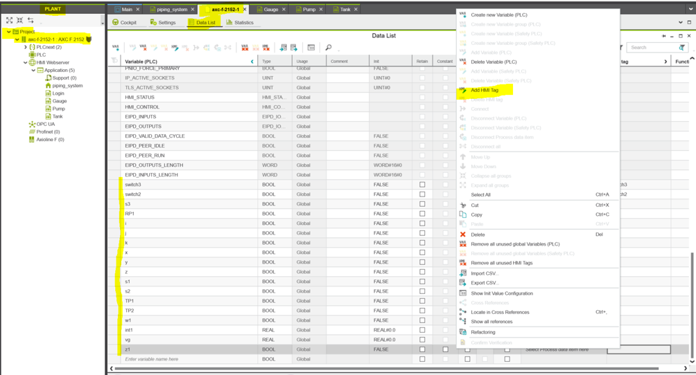

- You can then use these variables in the HMI Page where variables can be placed. Such as for dynamics or under behavior for buttons etc. 

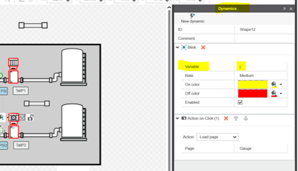
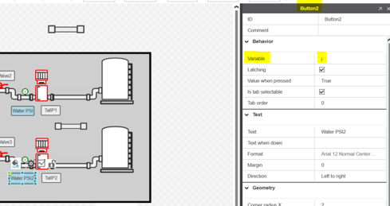

### Final Product

### Another Example (Final Product)

-  Time 3 hours
- Includes blink animation, fill animation for pipes and tanks, color change animation for valves and pumps. (Does not include translation animations or rotations)

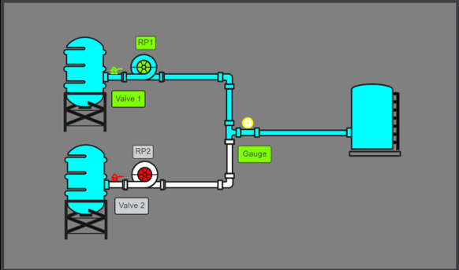
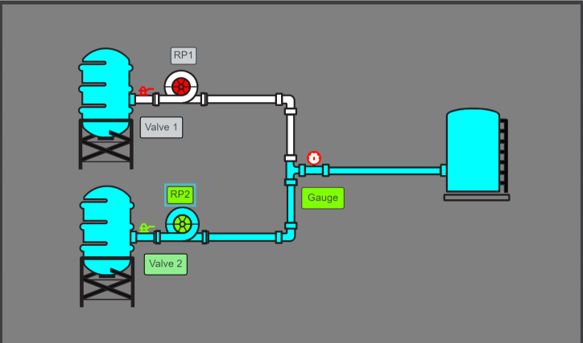

### Bonus Add Physical Buttons

- If you have the PLCnext starter kit available you can create variables in PLCnext Engineer that connect to the phyical switches on the PLCnext starter kit. To do this I reccomend watching the following videos:
    - Youtube: https://www.youtube.com/watch?v=cRBcxNtmn5A&list=PLTLcz6IpeLYLidXE0y6bIwD5cBRZp7dMt&index=5
    - Youtube: https://www.youtube.com/watch?v=kenDQYC7B14&list=PLTLcz6IpeLYLidXE0y6bIwD5cBRZp7dMt&index=6

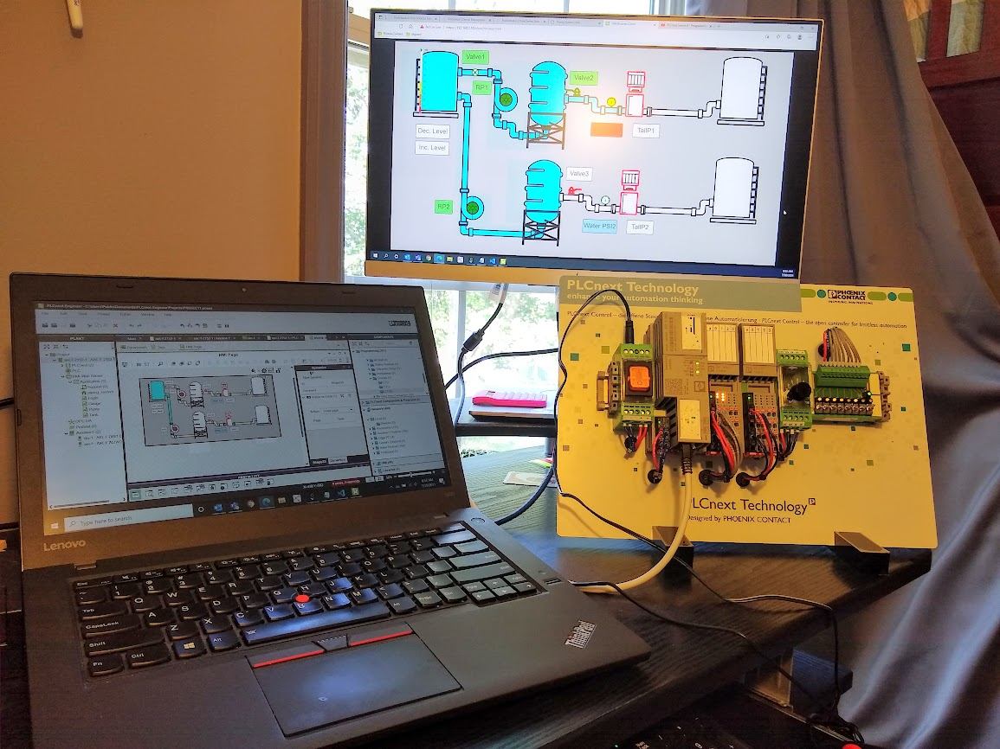